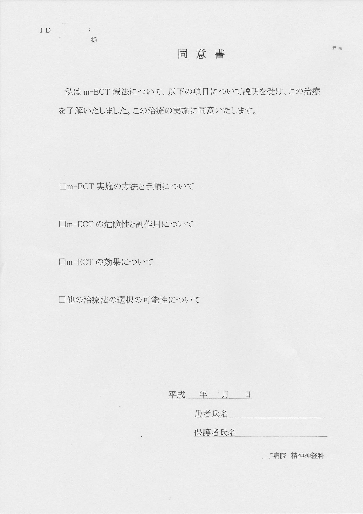
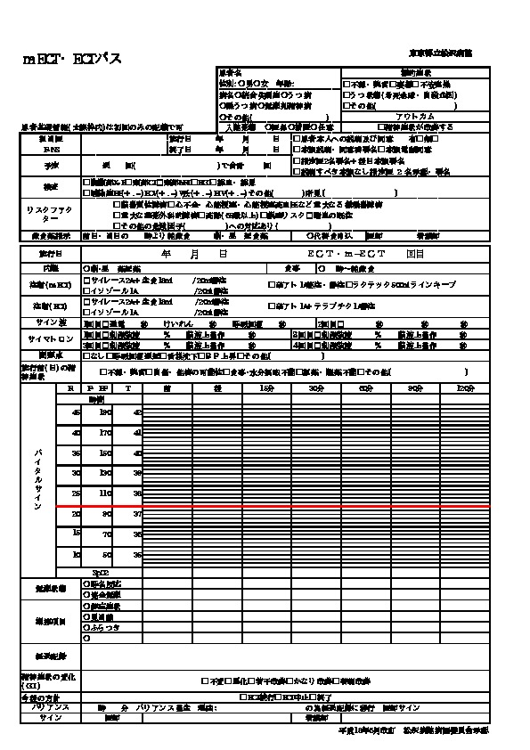

# ECT実施マニュアル

本書の目的

## 術前の準備 

* 精神医学的な病歴の聴取
		
	薬物アレルギー、緑内障の有無などを確認する。
* 身体的な診察
		
	義歯やペースメーカーの有無を確認する。ペースメーカーは誤作動の恐れがある。
* 内服中の投薬の確認
	
	リチウム、抗てんかん薬、抗不安薬などの有無を確認する。
* 術前検査
	
	採血、心電図、胸部単純写真、頭部CTなどを実施する。特に頭部CTでは頭蓋内占拠病変の有無に注意する。
* 同意書の取得
	
	本人の同意を得られない場合は、入院同意者から同意を得る

##  施行当日の準備 

1. 施行の少なくとも6時間前からは絶飲食とする。
   午後に実施する場合は、朝食後より絶飲食とする。
1. 病衣に着替えておく
1. 施行前に、静脈路を確保し、排尿誘導しておく。
   ハルトマン500mL

### 施行の手順

1. 本人であること，必要な前処置が行われていることを確認し、患者を治療ベッドに移動する 
1. 血圧計，心電図モニター，パルスオキシメーターを装着し，バイタルサインを記録する 
1. 右下腿にもう 1 つの血圧計カフを装着する（運動性けいれん発作のモニター用） 
	
	血圧カフを収縮期血圧よりも 10mmHg 程度高くして、カフより遠位に筋弛緩薬が到達しないようにする。
1. ECT 装置の脳波・筋電図・心電図電極部位と刺激電極部位を準備し（記録電極はアルコール綿，刺激電極は生理食塩 水を含んだガーゼでよく拭き，乾燥させる），電極を設置する
1. ECT装置をテストする
    - セルフテストで回路のインピーダンスの適切性を確認する
    - タップテストで脳波，筋電図の感度の適切性を確認する
1. 刺激変数を設定する
	
	特定のプロトコル(年齢半分法など)に従って刺激用量を設定する。
1. 100％酸素による酸素化を開始する 
1. バイタルが安定していることを確認したら，麻酔導入の開始を宣言する 
1. 静脈麻酔薬を投与する
   ラボナール 20mL
   <!-- チオペンタール 2∼5 mg/kg またはプロポフォール 0.75∼1.5 mg/kg -->
1. 意識が消失し，換気が万全である(年齢半分法など)ことを確認してから，筋弛緩薬を静脈内にボーラス注入し
   筋弛緩薬はエスラックス1A
   拮抗薬はブリディオン
   <!-- サクシニルコリン 0.5∼1.0 mg/kgを注入後、ルート内に殘る薬液をフラッシュ -->
1. 線維性筋攣縮で筋弛緩薬の効果を確認し，下腿部での消失を確認する 
1. バイトブロックを挿入する
	
    舌が口腔内で後下方に押されていること，顎が挙上されてバイトブロックに対してしっかり固定されていることを確認する。
1. 人工換気を一旦止めて，電気刺激を与える 
1. 人工換気を再開する 
1. 脳波上の発作と運動性の発作を観察し，両者の持続時間を計測する
1. 運動性発作が終了したら，右下腿の血圧カフから空気を抜く 
1. 人工換気と呼吸・循環のモニタリングを継続し，できるだけ刺激の少ない環境の中で患者が覚醒できるようにする 
1. 自発呼吸を再開し，覚醒した後は，回復室にてバイタルサインをモニターし，呼吸・循環動態が安定するのを待つ 

## 施行の手順

<!-- * タップテストで脳波，筋電図の感度の適切性を確認 -->
<!-- * セルフテストで回路のインピーダンスの適切性を確認 -->
<!--   インピーダンスは 100-3000Ω以下におさめる。 -->
<!-- * 刺激変数を設定する （例：エネルギー量） -->

### インピーダンスの調整

刺激電極を装着前に、皮膚を洗浄する。
インピーダンスを調べて調整する。

インピーダンスが機器の推奨範囲よりも大きい場合は、 1) 刺激電極の圧迫を強める 2) 伝導液をつける、などの対策を講じる。
特にインピーダンスが3000Ω以上では、皮膚の火傷の恐れがある。

<!-- 筋弛緩薬を投与する前に、血圧計のカフを片方の足に巻いて、収縮期血圧よりも 10mg 程度高く加圧しておく。 -->

### 刺激用量の設定 @mehul12, @abrams05,p.94

<!-- ###  電気刺激によるてんかん発作の誘発 ### -->

てんかん発作の閾値を超える電気刺激を加えて、発作を誘発させる。
<!-- てんかん発作の誘発には、電圧よりも電流のほうが重要である。 -->
<!-- ECT機器は流れる電流が一定になるよう設定できる。 -->

発作の誘発に重要な因子は以下のとおり。

* てんかん発作の閾値
    - 高齢の男性ほど閾値が高い
    - 内服薬の作用(ベンゾジアゼピン系は閾値を下げ、リチウムや抗てんかん薬は上げる)
    - 低いインピーダンスは頭皮で電流の短絡が生じて発作の誘発を妨げる
* 刺激用量は治療効果に最も影響する因子である
* ECTの施行回数が多ければ多いほど、閾値は上がる
<!-- * 刺激時間 -->
<!--   長時間の刺激は発作後に記憶障害を生じさせる危険がある。 -->
<!-- 発作持続時間と治療効果との関係は不明な点が多い。 -->
<!-- あいだには明らかな正の相関は認められない。 -->
<!-- 発作持続時間と治療効果とのあいだには反比例の関係が存在するという研究もある。 -->

刺激用量は回数を追うごとに増やす必要がある。

年齢半分法 half-age
	
	年齢の半分の % から刺激を開始し、発作が不発の場合は刺激用量を1.5倍あるいは2倍に設定する。

<!-- 刺激強度は、電気量かエネルギー量で表わされる。 -->
<!-- 電気量は、パルス幅(msec)、電流値(A)、周波数(Hz)、通電時間(sec) をもとにして -->
<!-- \\[ -->
<!--   電気量 (mC) = 電流 \times 時間 = パルス幅 \times 電流値 \times 2 \times 周波数 \times 通電時間  -->
<!-- \\] -->
<!-- \\[ -->
<!--   刺激用量 (mC) = 2.5 \times 年齢 -->
<!-- \\] -->
<!-- 以下の式により、けいれん閾値の約2.5倍の刺激用量を得る。 -->
<!-- \\[ -->
<!--   刺激用量 (mC) = 5 \times 年齢 -->
<!-- \\] -->

刺激部位は両側ECTで実施する。

### 発作が誘発されない場合の対処

良好な発作では、両側性の強直間代性発作で持続時間が少なくとも20~30秒程度あり、かつEEG上も同程度のてんかん波が出現している。

初回の刺激で発作がない場合、10~15秒程度待ったのちにおよそ1.5倍(50%)あげて再度刺激する。
発作が短時間発作(15秒以内)の場合、発作不応期を避けるため45秒以上の間隔をあける。
それでも発作がない場合は、さらに1段階あげて再刺激する。
再刺激は最大で4回まで可とされている。

###  施行中の身体管理 

全身麻酔下で筋弛緩剤を投与し、心電図、呼吸状態、脳波をモニターしながら身体管理を実施する。

* 筋弛緩薬には、サクシニルコリンを 0.5~1mg/kg、あるいは臭化ベクロニウム 0.08~0.1mg/kgを利用することが多い。
* 呼吸器では、換気を麻酔導入前より開始し、刺激の直前で中断し、刺激後に再開する。酸素飽和度を常に監視する。
* 電気刺激によって不整脈が誘発される場合があるので、心電図によるモニタリングは必須である。
  徐脈の際にはアトロピンを利用することがある。
<!-- このときは、麻酔の数分前に 0.1mg/kgを静注する。 -->

## 治療スケジュール

米国では週3回、英国では週2回の頻度で施行されることが多い。
週3回のほうが効果発現が早いが、週2回のほうが認知機能への副作用の頻度が少ないという研究がある。

1コース中の総回数は、反応の早さと質、疾患の重症度、副作用の有無などで決まる。

--------------------------------------------------

##  参考資料 

### サイマトロン

<!--  -->

### ECT同意書

### ECT記録用紙

### 書誌

